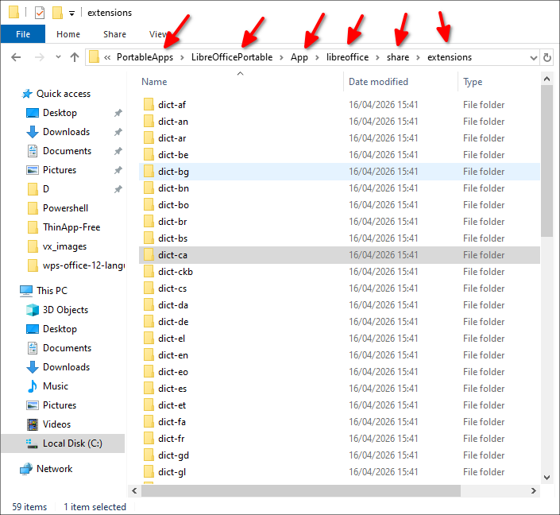

# LibreOffice Dictionaries Collection

[](https://www.gnu.org/licenses/gpl-3.0)
[](https://github.com/usuario/libreoffice-dictionaries-collection)

> Colección completa de diccionarios multilingües extraídos de LibreOffice Portable 25.2.3

## 📚 Descripción
Este repositorio contiene **138 diccionarios** de LibreOffice en 42 idiomas, incluyendo:
- **Corrección ortográfica** (archivos `.aff` + `.dic`)
- **Sinónimos** (archivos `.dat` + `.idx`)
- **División silábica** (archivos `hyph_*.dic`)

Extraídos de la versión [LibreOffice Portable 25.2.3](https://portableapps.com/apps/office/libreoffice_portable) para uso en:
- OpenOffice/LibreOffice
- Navegadores (Firefox, Thunderbird)
- Editores de texto
- Proyectos de software libre

## 🌍 Idiomas disponibles

The **path** to where they were located is this:

🗀 PortableApps → LibreOfficePortable → App → libreoffice → share → extensions



|  **Código**   |      **Idioma**      |
| ------------- | -------------------- |
| 🗀 dict-af    | Afrikaans            |
| 🗀 dict-an    | Aragonés             |
| 🗀 dict-ar    | Árabe                |
| 🗀 dict-be    | Bielorruso           |
| 🗀 dict-bg    | Búlgaro              |
| 🗀 dict-bn    | Bengalí              |
| 🗀 dict-bo    | Tibetano             |
| 🗀 dict-br    | Bretón               |
| 🗀 dict-bs    | Bosnio               |
| 🗀 dict-ca    | Catalán              |
| 🗀 dict-ckb   | Kurdo central        |
| 🗀 dict-cs    | Checo                |
| 🗀 dict-da    | Danés                |
| 🗀 dict-de    | Alemán               |
| 🗀 dict-el    | Griego               |
| 🗀 dict-en    | Inglés               |
| 🗀 dict-eo    | Esperanto            |
| 🗀 dict-es    | Español              |
| 🗀 dict-et    | Estonio              |
| 🗀 dict-fa    | Persa                |
| 🗀 dict-fr    | Francés              |
| 🗀 dict-gd    | Gaélico escocés      |
| 🗀 dict-gl    | Gallego              |
| 🗀 dict-gu    | Guyaratí             |
| 🗀 dict-he    | Hebreo               |
| 🗀 dict-hi    | Hindi                |
| 🗀 dict-hr    | Croata               |
| 🗀 dict-hu    | Húngaro              |
| 🗀 dict-id    | Indonesio            |
| 🗀 dict-is    | Islandés             |
| 🗀 dict-it    | Italiano             |
| 🗀 dict-ko    | Coreano              |
| 🗀 dict-lo    | Lao                  |
| 🗀 dict-lt    | Lituano              |
| 🗀 dict-lv    | Letón                |
| 🗀 dict-mn    | Mongol               |
| 🗀 dict-ne    | Nepalí               |
| 🗀 dict-nl    | Neerlandés           |
| 🗀 dict-no    | Noruego              |
| 🗀 dict-oc    | Occitano             |
| 🗀 dict-pl    | Polaco               |
| 🗀 dict-pt-BR | Portugués (Brasil)   |
| 🗀 dict-pt-PT | Portugués (Portugal) |
| 🗀 dict-ro    | Rumano               |
| 🗀 dict-ru    | Ruso                 |
| 🗀 dict-si    | Cingalés             |
| 🗀 dict-sk    | Eslovaco             |
| 🗀 dict-sl    | Esloveno             |
| 🗀 dict-sq    | Albanés              |
| 🗀 dict-sr    | Serbio               |
| 🗀 dict-sv    | Sueco                |
| 🗀 dict-te    | Telugu               |
| 🗀 dict-th    | Tailandés            |
| 🗀 dict-tr    | Turco                |
| 🗀 dict-uk    | Ucraniano            |
| 🗀 dict-vi    | Vietnamita           |
| 🗀 dict-zu    | Zulú                 |

Esta tabla incluye los 42 idiomas disponibles en la colección, manteniendo los códigos originales de LibreOffice y sus nombres en español para mayor claridad. Los códigos con guion (como pt-BR y pt-PT) representan variantes regionales específicas del idioma.

La **ruta** donde estaban es esta:  

🗀 PortableApps → LibreOfficePortable → App → libreoffice → share → extensions


## 🚀 Uso en aplicaciones

### Para OpenOffice/LibreOffice:

1.  Descargue la carpeta del idioma necesario.
2.  Copie los archivos `.aff` y `.dic` a:

```
/usr/share/hunspell/  (Linux)
C:\Program Files\LibreOffice\share\extensions\dict\  (Windows)
```

3.  Reinicie la aplicación.

### Para Firefox/Thunderbird:

1.  Copie los archivos `.aff` y `.dic` al perfil de usuario:

```
[Profile]/dictionaries/
```

2.  Reinicie la aplicación.

---

### Para desarrolladores (Hunspell):
```python
import hunspell
hunspell_object = hunspell.Hunspell("es_ES.dic", "es_ES.aff")
```

## ⚖️ Licencias

Cada diccionario tiene su propia licencia. Verifica los archivos:

- `LICENSE*.txt`
- `COPYING*`
- `README_*.txt`

La mayoría usan:

- **GPL**, **LGPL**, **MPL** (Mozilla Public License)
- Licencias de código abierto (BSD, MIT, etc.)

## 🔧 Estructura de archivos

```
dict-xx/
├── xx_YY.aff       # Reglas de afijos
├── xx_YY.dic       # Diccionario principal
├── hyph_xx_YY.dic  # División silábica
├── th_xx_YY.dat    # Sinónimos (datos)
├── th_xx_YY.idx    # Sinónimos (índice)
├── description.xml # Metadatos
├── dictionaries.xcu# Configuración
└── README_*.txt    # Información del idioma
```

## 🔗 Usar como Submódulo de Git

Este repositorio puede usarse como un **submódulo de Git** en otros proyectos que requieran funcionalidad de diccionarios. Esto es especialmente útil para:

- Editores de texto
- Procesadores de texto
- Aplicaciones de aprendizaje de idiomas
- Cualquier software que necesite procesamiento de texto multilingüe

### 🐍 Ejemplo de Integración: Aplicación Python/PyQt6

#### 1. Añadir como Submódulo
En la raíz de tu proyecto:

```bash
git submodule add https://github.com/wachin/libreoffice-dictionaries-collection.git libs/dictionaries
git commit -m "Añadir submódulo de diccionarios"
```

#### 2. Instalar Dependencias (Ubuntu/Debian)

```bash
sudo apt-get install python3-pyqt6 python3-enchant python3-hunspell python3-pyphen libmythes-1.2-0 libmythes-dev
pip install git+https://github.com/corerd/pythes
```

#### 3. Estructura del Proyecto

```
tu-proyecto/
├── .gitmodules
├── main.py
├── requirements.txt
└── libs/
    └── dictionaries/  # Submódulo
        ├── dicts/
        │   ├── dict-es/
        │   ├── dict-en/
        │   └── ...
        └── README.md
```

#### 4. Implementación del Código

```python
import os
import sys
from PyQt6.QtWidgets import QApplication, QMainWindow, QTextEdit, QVBoxLayout, QWidget, QPushButton

# Librerías de diccionarios
import enchant
import hunspell
import pyphen
from pythes import Thesaurus

class DictionaryApp(QMainWindow):
    def __init__(self):
        super().__init__()
        self.dict_path = os.path.join(os.path.dirname(__file__), 
                                     "libs", "dictionaries", "dicts")
        self.init_ui()
        self.init_dictionaries()
    
    def init_ui(self):
        self.setWindowTitle("Procesador de Diccionarios")
        self.setGeometry(100, 100, 800, 600)
        
        # Layout
        layout = QVBoxLayout()
        self.text_edit = QTextEdit()
        layout.addWidget(self.text_edit)
        
        # Botones
        btn_spell = QPushButton("Verificar Ortografía")
        btn_spell.clicked.connect(self.check_spelling)
        layout.addWidget(btn_spell)
        
        btn_hyphen = QPushButton("Dividir Sílabas")
        btn_hyphen.clicked.connect(self.hyphenate_text)
        layout.addWidget(btn_hyphen)
        
        btn_synonyms = QPushButton("Obtener Sinónimos")
        btn_synonyms.clicked.connect(self.get_synonyms)
        layout.addWidget(btn_synonyms)
        
        container = QWidget()
        container.setLayout(layout)
        self.setCentralWidget(container)
    
    def init_dictionaries(self):
        # Inicializar diccionarios en español
        lang = "es"
        lang_path = os.path.join(self.dict_path, f"dict-{lang}")
        
        # Corrección ortográfica (Hunspell)
        self.hunspell = hunspell.HunSpell(
            os.path.join(lang_path, f"{lang}_ES.aff"),
            os.path.join(lang_path, f"{lang}_ES.dic")
        )
        
        # División silábica (Pyphen)
        self.pyphen = pyphen.Pyphen(lang=f"{lang}_ES")
        
        # Tesauro (MyThes)
        self.thesaurus = Thesaurus(
            os.path.join(lang_path, f"th_{lang}_ES_v2.dat"),
            os.path.join(lang_path, f"th_{lang}_ES_v2.idx")
        )
    
    def check_spelling(self):
        text = self.text_edit.toPlainText()
        words = text.split()
        
        print("\n=== RESULTADOS DE VERIFICACIÓN ORTOGRÁFICA ===")
        for word in words:
            word = word.strip(".,!?;:")
            if word:
                if self.hunspell.spell(word):
                    print(f"✓ {word}")
                else:
                    suggestions = self.hunspell.suggest(word)
                    print(f"✗ {word} -> {suggestions[:3]}")  # Mostrar 3 sugerencias
    
    def hyphenate_text(self):
        text = self.text_edit.toPlainText()
        words = text.split()
        
        print("\n=== RESULTADOS DE DIVISIÓN SILÁBICA ===")
        for word in words:
            word = word.strip(".,!?;:")
            if word:
                hyphenated = self.pyphen.inserted(word)
                print(f"{word} -> {hyphenated}")
    
    def get_synonyms(self):
        word = self.text_edit.toPlainText().strip()
        if not word:
            return
            
        print(f"\n=== SINÓNIMOS DE '{word}' ===")
        meanings = self.thesaurus.lookup(word)
        if meanings:
            for i, meaning in enumerate(meanings[:3], 1):  # Mostrar 3 significados
                print(f"{i}. {meaning.description}:")
                print(f"   {', '.join(meaning.synonyms[:5])}")  # Mostrar 5 sinónimos
        else:
            print("No se encontraron sinónimos")

if __name__ == "__main__":
    app = QApplication(sys.argv)
    window = DictionaryApp()
    window.show()
    sys.exit(app.exec())
```

### 📚 Ejemplos de Uso de Diccionarios

#### Corrección Ortográfica (Hunspell)

```python
import hunspell

# Inicializar diccionario
h = hunspell.HunSpell("libs/dictionaries/dicts/dict-es/es_ES.aff", 
                     "libs/dictionaries/dicts/dict-es/es_ES.dic")

# Verificar palabra
word = "computadora"
if h.spell(word):
    print(f"'{word}' es correcta")
else:
    suggestions = h.suggest(word)
    print(f"Sugerencias: {suggestions}")
```

#### División Silábica (Pyphen)

```python
import pyphen

# Inicializar diccionario
dic = pyphen.Pyphen(lang='es_ES')

# Dividir palabra
word = "extraordinario"
hyphenated = dic.inserted(word)  # "ex-tra-or-di-na-rio"
print(f"División silábica: {hyphenated}")
```

#### Tesauro (MyThes vía pythes)

```python
from pythes import Thesaurus

# Inicializar tesauro
thes = Thesaurus("libs/dictionaries/dicts/dict-es/th_es_ES_v2.dat",
                 "libs/dictionaries/dicts/dict-es/th_es_ES_v2.idx")

# Obtener sinónimos
word = "rápido"
meanings = thes.lookup(word)
for meaning in meanings:
    print(f"{meaning.description}: {meaning.synonyms}")
```

### 🔄 Actualizar Submódulo
Para actualizar los diccionarios a la última versión:
```bash
git submodule update --remote --merge
```

### 💡 Beneficios de Usar como Submódulo

1. **Gestión Centralizada**: Única fuente para todos los diccionarios
2. **Control de Versiones**: Fijar versiones específicas de diccionarios
3. **Eficiencia de Espacio**: Diccionarios almacenados una vez, referenciados por múltiples proyectos
4. **Actualizaciones Sencillas**: Actualizar todos los diccionarios con un comando
5. **Colaboración**: Contribuir mejoraciones al proyecto original

### 🛠️ Librerías Soportadas

|     Funcionalidad      |   Librería    | Archivos Utilizados |
| ---------------------- | ------------- | ------------------- |
| Corrección Ortográfica | hunspell      | `.aff` + `.dic`     |
| División Silábica      | pyphen        | Patrones `.dic`     |
| Tesauro                | pythes/MyThes | `.dat` + `.idx`     |
| Alternativa            | enchant       | `.aff` + `.dic`     |


## 🤝 Contribuciones
¡Las contribuciones son bienvenidas! Si encuentras:
- Diccionarios faltantes
- Errores en los archivos

Abre un *issue* o envía un *pull request*.

## 📄 Créditos

- **Fuente original**: [LibreOffice Portable](https://portableapps.com/)
- **Desarrolladores**: Equipo de LibreOffice y colaboradores de diccionarios
- **Licencias**: Ver archivos específicos de cada idioma

---

**Última actualización**: Extraídos de LibreOffice 25.2.3 (2025)